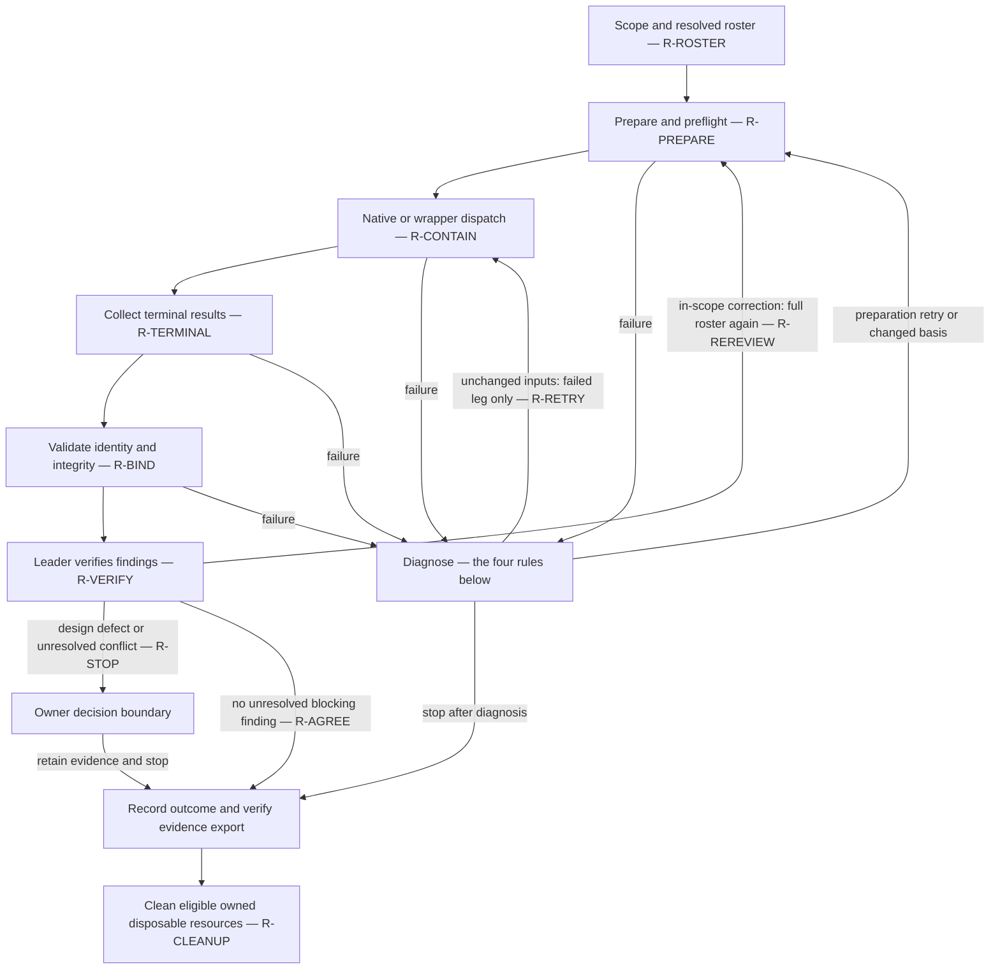

# The shared review process

One diagram, shared by both hosts (owner R7). Nodes navigate; the rules live in `review-rules.md` and are referenced by
anchor. Host skills adapt invocation syntax only.

## Failure diagnosis — the same four rules at every step

1. Check whether skill instructions, examples or interface discovery are ambiguous or incomplete before attributing a
   failure to a leader mistake.
2. Inspect the actual invocation and the deterministic implementation; distinguish an instruction or call defect, an
   infrastructure defect, a provider or transient failure, and an unconfirmed cause, using evidence. Decide whether a small
   code check or composition step prevents recurrence; do not create a framework by default.
3. Preserve and validate findings from the legs that succeeded, and do the in-scope correction work even if another leg
   failed to run. When an existing or approved design is shown defective, stop implementation, obtain independent
   read-only diagnosis from the other families, and brief the owner before changing that design.
4. After diagnosis, retry only the failed leg when source, prompts, criteria, roster, model, effort, route and review policy
   are unchanged (R-RETRY). Before dispatch exists, retry the corrected preparation step. Any correction to reviewed content
   or review conditions is a new bound basis and a complete full-scope review by the participating roster (R-REREVIEW);
   replacing a leg never relabels a failed round as approved.

Failures keep their terminal evidence and an actionable next step. Repeated or conflicting findings that do not converge
go to leader analysis and the owner decision boundary (R-STOP), not to an automatic correction loop. Evidence export and
safe termination apply to failed and stopped work too; neither implies approval. Cleanup refuses when ownership, export
verification or a lifecycle precondition is unresolved (R-CLEANUP).
